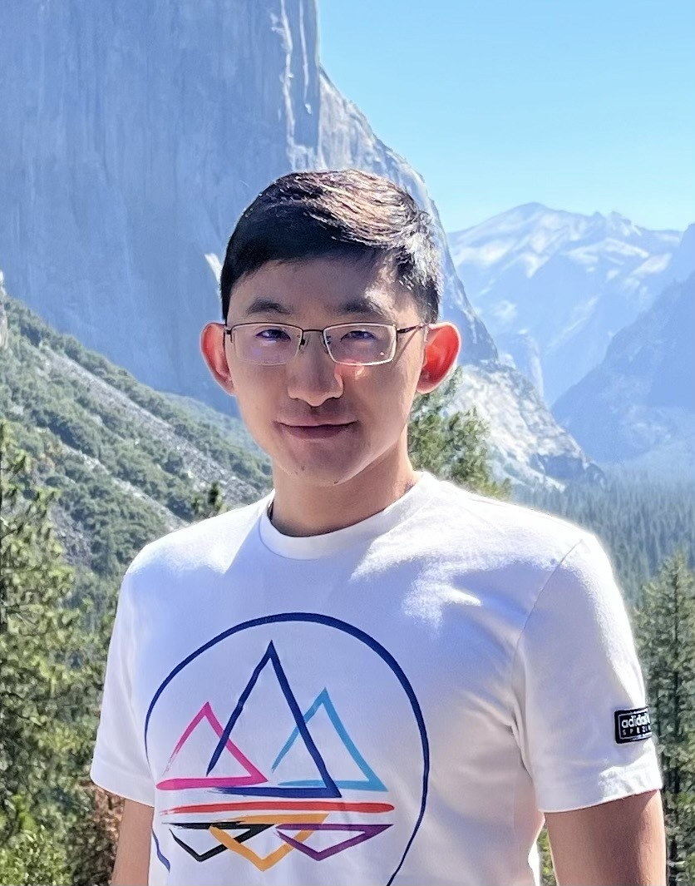

* content
{:toc}

 
## **Jinwen Wang**
 
|  He is a final year Ph.D. candidate in the Department of Computer Science and Engineering at Washington University in St. Louis (WashU). He is currently working in Computer Security and Privacy Lab under the supervision of [Prof. Ning Zhang](https://cybersecurity.seas.wustl.edu/ning/index.html). He earned his M.S. in Computer Science from Tsinghua University (THU) in 2019, where he was advised by [Prof. Qi Li](https://sites.google.com/site/qili2012/) in 2019, and his B.E. in Computer Science from Sichuan University (SCU) in 2016.   His research interests include **System Security**, **Software Security**, **Cyber-physical Systems (CPS)**, **Secure and Privacy-preserving ML System**. He focuses on securing cyber-physical systems and MLSys by designing and implementing efficient runtime security mechanisms, including attack isolation (TEE on CPU and GPU), prevention (CFI, DFI, privacy-preserving ML systems), and mitigation (recovery). He also develops scalable security reasoning approaches (remote attestation and fuzzing). His work spans various CPSs, including autonomous vehicles and medical devices, with diverse architectures like CPUs and GPUs.    **Email:** <jinwen.wang@wustl.edu>      |   &emsp;      |

***I am on the job market in the 2024-2025 cycle, please feel free to reach out!*** 

## News

---
* My two papers " Software Availability Protection in Cyber-Physical Systems" and "Secure Information Embedding in Forensic 3D Fingerprinting" has been accepted in USENIX Security 2025!

* I am invited to serve on the TPC of USENIX VehicleSec 2025!

* Our paper "Adapbox: Adaptive sandboxing in medical systems with ebpf" was accepted by [AACD'2024](https://aacd24.github.io). Congratulations to Sinyin!

* Our paper "An Empirical Study of Performance Interference: Timing Violation Patterns and Impacts" was accepted by [RTAS'2024](https://2024.rtas.org). Congratulations to Ao!

* I am invited to serve on the TPC of USENIX ATC 2024!

* Our two papers "Opportunistic Data Flow Integrity for Real-time Cyber-physical Systems Using Worst Case Execution Time Reservation" and " “Your Firmware Has Arrived: A Study of Firmware Update Vulnerabilities" were accepted by [Security'2024](https://www.usenix.org/conference/usenixsecurity24). Congratulations to Yujie and Yuhao!

* I am invited to serve on the TPC of USENIX Security Artifact Evaluation 2024!

* My paper "Secure and Timely GPU Execution in Cyber-physical Systems" was accepted by [CCS'2023](https://www.sigsac.org/ccs/CCS2023/). 

* My demo "Demo: Real-time System Availability for Cyber-physical Systems using ARM TrustZone" won VehicleSec Qualcomm Best Demo Award Runner Up in [VehicleSec'2023](https://www.ndss-symposium.org/ndss2023/co-located-events/vehiclesec/).

* My paper "ARI: Attestation of Real-time Mission Execution Integrity" was accepted by [Security'2023](https://www.usenix.org/conference/usenixsecurity23). 

<!-- * My paper "IP Protection in TinyML" was accepted by [DAC'2023](https://www.dac.com/About/Conference-Archive/60th-DAC-2023). -->

<!-- * My extended paper "Interface-Based Side Channel in TEE-Assisted Networked Services" was accepted by ToN.

* Our paper "Procrastinating Control-Flow Integrity Framework for Periodic Real-Time Systems" was accepted by [RTNS'2023](https://rtns2023.cs.tu-dortmund.de). Congratulations to Tanmaya!

* My paper " RT-TEE: Real-time System Availability for Cyber-physical Systems using ARM TrustZone" was accepted by [S&P'2022](https://www.ieee-security.org/TC/SP2022/).

* Our paper "From Timing Variations to Performance Degradation: Understanding and Mitigating the Impact of Software Execution Timing in SLAM" was accepted by [IROS'2022](https://www.ieee-security.org/TC/SP2022/). Congratulations to Ao!

* Our paper " Chronos: Timing Interference as a New Attack Vector on Autonomous Cyber-physical Systems" was accepted by [CCS'2021](https://www.sigsac.org/ccs/CCS2021/). Congratulations to Ao! -->

[**Full News List**](https://j1nwenwang.github.io/news/)
<!-- [**Full News List**](../news/) -->

## Selected Publications
---
<!-- \* co-first authors -->

* **[Security 25]** **<u>Jinwen Wang*</u>**, Ao Li*, and Ning Zhang, "[Software Availability Protection in Cyber-physical Systems](https://j1nwenwang.github.io)", 34th USENIX Security Symposium, 2025. To be appeared.

* **[Security 25]** Canran Wang*, **<u>Jinwen Wang*</u>**, Mi Zhou, Vinh Pham, Senyue Hao, Chao Zhou, Ning Zhang, and Netanel Raviv, "[Secure Information Embedding in Forensic 3D Fingerprinting](https://j1nwenwang.github.io)", 34th USENIX Security Symposium, 2025. To be appeared.

* **[RTAS 24]** Ao Li, **<u>Jinwen Wang</u>**, Sanjoy Baruah, Bruno Sinopoli, and Ning Zhang, "[An Empirical Study of Performance Interference: Timing Violation Patterns and Impacts](https://cybersecurity.seas.wustl.edu/paper/rtas24_timetrap.pdf)", 30th IEEE Real-Time and Embedded Technology and Applications Symposium, 2024.

* **[Security 24]** Yujie Wang, Ao Li, **<u>Jinwen Wang</u>**, Sanjoy Baruah, and Ning Zhang, "[Opportunistic Data Flow Integrity for Real-time Cyber-physical Systems Using Worst Case Execution Time Reservation](https://www.usenix.org/system/files/sec23winter-prepub-485-wang-yujie.pdf)", 33rd USENIX Security Symposium, 2024.

* **[Security 24]** Yuhao Wu, **<u>Jinwen Wang</u>**, Yujie Wang, Shixuan Zhai, Zihan Li, Yi He, Kun Sun, Qi Li, and Ning Zhang, "[Your Firmware Has Arrived: A Study of Firmware Update Vulnerabilities](https://www.usenix.org/system/files/usenixsecurity24-wu-yuhao.pdf)", 33rd USENIX Security Symposium, 2024.

* **[CCS 23]** **<u>Jinwen Wang</u>**, Yujie Wang, and Ning Zhang, "[Secure and Timely GPU Execution in Cyber-physical Systems](https://dl.acm.org/doi/pdf/10.1145/3576915.3623197)", 30th ACM Conference on Computer and Communications Security, 2023.

* **[Security 23]**  **<u>Jinwen Wang</u>**, Yujie Wang, Ao Li, Yang Xiao, Ruide Zhang, Wenjing Lou, Y. Thomas Hou, and Ning Zhang, "[ARI: Attestation of Real-time Mission Execution Integrity](https://www.usenix.org/system/files/usenixsecurity23-wang-jinwen.pdf)", 32nd USENIX Security Symposium, 2023.

* **[DAC 23]** **<u>Jinwen Wang</u>**, Yuhao Wu, Han Liu, Bo Yuan, Roger Chamberlain, and Ning Zhang, "[IP Protection in TinyML](https://cybersecurity.seas.wustl.edu/paper/wang2023ip.pdf)", 60th ACM/IEEE Design Automation Conference, 2023.

<!-- * **[ToN]** Xiaohan Zhang, **<u>Jinwen Wang</u>**, Yueqiang Cheng, Qi Li, Kun Sun, Yao Zheng, Ning Zhang, and Xinghua Li, "[Interface-Based Side Channel in TEE-Assisted Networked Services](https://ieeexplore.ieee.org/abstract/document/10184979)", IEEE/ACM Transactions on Networking (**TON**).

* **[RTNS 23]** Tanmaya Mishra, **<u>Jinwen Wang</u>**, Thidapat Chantem, Ryan Gerdes and Ning Zhang, "[A Procrastinating Control-Flow Integrity Framework for Periodic Real-Time Systems](https://dl.acm.org/doi/pdf/10.1145/3575757.3575762)", 31st International Conference on Real-Time Networks and Systems, 2023. -->

* **[S&P 22]** **<u>Jinwen Wang</u>**, Ao Li, Haoran Li, Chenyang Lu, and Ning Zhang, "[RT-TEE: Real-time System Availability for Cyber-physical Systems using ARM TrustZone](https://par.nsf.gov/servlets/purl/10373878)", 43rd IEEE Symposium on Security and Privacy, 2022. *(**VehicleSec Qualcomm Best Demo Award Runner Up**)*. 

* **[IROS 22]** Ao Li, Han Liu, **<u>Jinwen Wang</u>**, and Ning Zhang, "[From Timing Variations to Performance Degradation: Understanding and Mitigating the Impact of Software Execution Timing in SLAM](https://cybersecurity.seas.wustl.edu/paper/ao-iros22.pdf)", IEEE/RSJ International Conference on Intelligent Robots and Systems, 2022.

[**Full Publication List**](https://j1nwenwang.github.io/publication/)

## Awards and Honors

---
*   VehicleSec Qualcomm Best Demo Award Runner Up 2023
*   Travel Grant in ACE CCS 2023
*   Travel Grant in USENIX Security 2023
*   Travel Grant in RTSS 2022
*   Travel Grant in IEEE S&P 2022
*   Dean’s International Fellowship in Washington University in St. Louis 2019
*   Second Class University Scholarship in Tsinghua University 2016
*   National Scholarship in China 2013

## Professional Services

---
**PC Member at Conferences:**
* USENIX VehicleSec 2025
* USENIX Security Artifact 2024
* USENIX Annual Technical Conference 2024

**Sub-reviewer at Conferences:**
* IEEE Symposium on Security and Privacy (S&P) 2023-2025
* USENIX Security Symposium (Security) 2023-2025
* ACM Conference on Computer and Communications Security (CCS) 2022-2023
* ISOC Network and Distributed System Security Symposium (NDSS) 2020-2023
* IEEE Annual Computer Security Applications Conference (ACSAC) 2024
* IEEE International Conference on Computer Communications (INFOCOM) 2019-2014
* ACM ASIA Conference on Computer and Communications Security (AsiaCCS) 2022-2023

**Reviewer for Journals:**
* IEEE/ACM Transactions on Networking (ToN)
* IEEE Transactions on Information Forensics and Security (TIFS)
* IEEE Transactions on Dependable and Secure Computing (TDSC)

## Talks

---

|10/2024|"Adapbox: Adaptive sandboxing in medical systems with ebpf", Invited Talk in ACM CCS Adaptive and Autonomous Cyber Defense (AACD) workshop 2024. |Salt Lake City, Utah, USA
|11/2023|"Secure and Timely GPU Execution in Cyber-physical Systems", Invited Talk in ACM CCS 2023. |Copenhagen, Denmark
|08/2023|"ARI: Attestation of Real-time Mission Execution Integrity", Invited Talk in USENIX Security 2023. |Anaheim, CA, USA
|07/2023|"IP Protection in TinyML", Invited Talk in IEEE/ACM DAC 2023. |San Francisco, CA, USA
|05/2022|"RT-TEE: Real-time System Availability for Cyber-physical Systems using ARM TrustZone", Invited Talk in IEEE S&P 2022. |San Francisco, CA, USA
